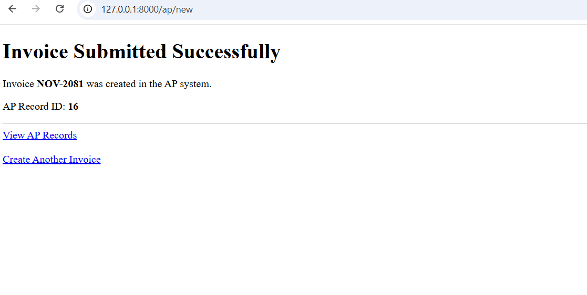
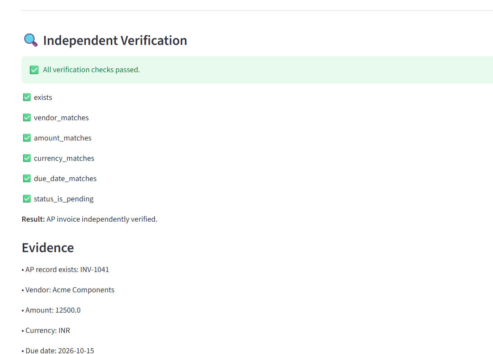

# Autonomous AI Task Worker

An AI-powered task worker that executes a simulated business workflow by combining language-model reasoning, browser automation, human approval, and independent verification.

The current implementation focuses on finding an invoice and adding it to an accounts-payable (AP) system.

## Demo

**[Watch the project demonstration](https://drive.google.com/file/d/1X-fLfq4JOl9w7eK7I1DplMbvu1tGXZW2/view?usp=drive_link)**

The demo covers task execution, invoice extraction, the human approval checkpoint, AP submission, and independent verification of the resulting record.

## Screenshots

### 1. Task Interface


The user provides a natural-language instruction to initiate the invoice-processing workflow.

### 2. Human Approval


The workflow pauses for human approval before submitting the accounts-payable record.

### 3. Invoice Submission



The invoice information is entered into the accounts-payable form before submission.

### 4. Verification Results



The independent verifier checks the resulting record against the expected invoice details, including vendor, amount, currency, due date, and pending status.

### 5. AP Invoice Records


The accounts-payable records page provides visual evidence of the stored invoice record.

## Key Features

- **Natural-language task input:** Specify an invoice-processing task in plain English.
- **LLM-assisted action planning:** A Groq-hosted language model proposes actions based on the task and observations.
- **Browser automation:** Playwright interacts with the simulated invoice portal and AP form.
- **Controlled execution:** Application code validates proposed actions against configured rules.
- **Human approval:** Submission is gated by an approval checkpoint.
- **Independent verification:** The system checks the resulting database record rather than relying solely on the agent's success message.
- **Execution state and recovery:** The workflow tracks observations, actions, errors, and execution state.
- **Automated tests:** pytest is used to test implemented components and behavior.

## Architecture

```text
User
 |
 v
Streamlit UI
 |
 v
Task Parsing and State
 |
 v
Agent Controller / Runner
 |                 |
 v                 v
Groq LLM       Policy Checks
 |                 |
 +--------+--------+
          |
          v
   Playwright Browser
          |
          v
 Simulated Invoice Portal
       FastAPI
          |
          v
 Human Approval Checkpoint
          |
          v
   AP Record Submission
          |
          v
 Independent Verification
          |
          v
     Final Result
          |
          v
        SQLite
```

### Components

| Component            | Responsibility                                              |
| -------------------- | ----------------------------------------------------------- |
| Streamlit            | User interface, task input, approval, and results           |
| Groq API             | Language-model-assisted action proposals                    |
| LangChain            | Language-model integration                                  |
| Agent controller     | Coordinates workflow execution and state                    |
| Playwright           | Browser navigation and interaction                          |
| FastAPI              | Simulated business application and API                      |
| SQLite               | Stores invoices and AP records                              |
| Policy layer         | Validates actions and enforces configured approval rules    |
| Independent verifier | Checks the final AP record against expected invoice details |
| pytest               | Automated testing                                           |

For additional implementation details, see [`docs/ARCHITECTURE.md`](docs/ARCHITECTURE.md) and [`docs/EVALUATION.md`](docs/EVALUATION.md).

## Technology Stack

- Python 3.12
- Groq API — `openai/gpt-oss-20b`
- LangChain
- Playwright
- FastAPI and Uvicorn
- Streamlit
- SQLite
- Pydantic
- pytest and pytest-asyncio
- python-dotenv

## Project Structure

```text
-Autonomous-AI-Task_Worker/
├── app/
│   ├── agent/
│   ├── models/
│   ├── safety/
│   ├── tools/
│   └── ui.py
├── sandbox/
│   ├── app.py
│   ├── database.py
│   └── seed.py
├── tests/
├── docs/
│   ├── ARCHITECTURE.md
│   └── EVALUATION.md
├── screenshots/
│   ├── 01-task-interface.png
│   ├── 02-human-approval.png
│   ├── 03-verification-success.png
│   └── 04-tests-passed.png
├── .env.example
├── .gitignore
├── pytest.ini
├── requirements.txt
└── README.md
```

The exact files and directory contents may vary slightly with the current implementation.

## Setup and Installation

### 1. Clone the repository

```bash
git clone https://github.com/YOUR_GITHUB_USERNAME/YOUR_REPOSITORY.git
cd YOUR_REPOSITORY
```

### 2. Create and activate a virtual environment

Windows PowerShell:

```powershell
py -3.12 -m venv .venv
.\.venv\Scripts\Activate.ps1
```

### 3. Install dependencies

```powershell
python -m pip install --upgrade pip
pip install -r requirements.txt
python -m playwright install chromium
```

### 4. Configure environment variables

Create a `.env` file in the project root using `.env.example` as a template:

```env
GROQ_API_KEY=your_groq_api_key_here
```

Replace the placeholder with your own Groq API key. Never commit the real `.env` file or expose the key in screenshots or logs.

### 5. Initialize the simulated database

```powershell
python -m sandbox.database
python -m sandbox.seed
```

Run database initialization only when appropriate for your existing data; reseeding or recreating the database may affect existing records.

### 6. Start the backend

Open a terminal in the project root:

```powershell
uvicorn sandbox.app:app --reload
```

The backend runs at `http://127.0.0.1:8000` by default.

### 7. Start the Streamlit interface

Open a second terminal in the project root and activate the same virtual environment:

```powershell
python -m streamlit run app/ui.py
```

Open the local address printed by Streamlit in your browser.

## Running the Demo

Use the following task in the Streamlit interface:

```text
Find invoice INV-1041 and add it to AP.
```

The expected workflow is:

1. Inspect the invoice portal.
2. Extract the relevant invoice information.
3. Prepare the accounts-payable record.
4. Pause for human approval.
5. Submit the record after approval.
6. Independently verify the stored result.

The demonstrated invoice has these expected values:

| Field          | Expected value  |
| -------------- | --------------- |
| Invoice number | INV-1041        |
| Vendor         | Acme Components |
| Amount         | 12,500 INR      |
| Due date       | 2026-10-15      |
| Status         | Pending         |

The successful demonstration passed all six configured verification checks.

## Running Tests

From the project root, run:

```powershell
pytest -q
```

A previous test run completed with:

```text
17 passed
```

Run the suite again against your final code before submission.

## Safety and Reliability

The implementation uses configured action validation and an approval checkpoint before AP submission. An independent verifier checks the stored record against expected invoice information.

The verifier checks:

- Record existence
- Vendor match
- Amount match
- Currency match
- Due-date match
- Pending status

These checks confirm the demonstrated outcome for the configured workflow. They do not guarantee success on arbitrary websites or business tasks.

## Limitations

- The workflow is specialized for invoice-to-AP processing.
- Portal URLs, selectors, invoice patterns, and verification rules are configured for the simulated environment.
- The post-approval submission flow is deterministic.
- Generalization to unfamiliar interfaces and workflows is limited.
- The project has not been validated as a production ERP integration.
- The current evaluation covers the implemented tests and demonstrated scenarios, not every possible failure condition.

## Future Improvements

- Support reusable task definitions for additional workflows.
- Improve selector grounding and recovery from UI changes.
- Expand evaluation coverage with failure-injection scenarios.
- Improve interrupted-session recovery and ambiguous-outcome handling.
- Add structured execution traces and audit logs.
- Strengthen authorization, isolation, and security for production use.

## Design Principle

**Language models propose actions, application code constrains execution, humans approve sensitive steps, and independent verification checks the result.**

## Author

**ULISETTI SAKETH UZVAL KRISHNA**
